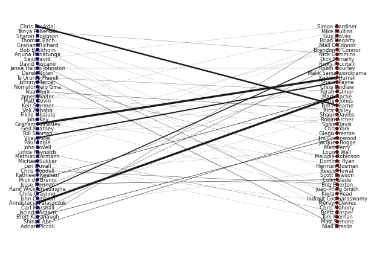
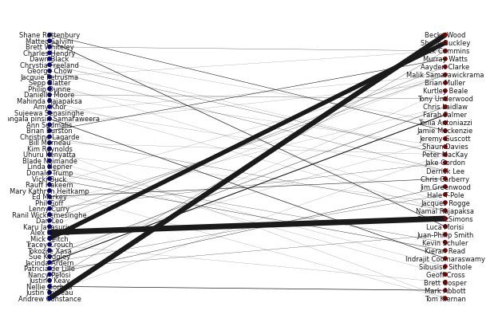
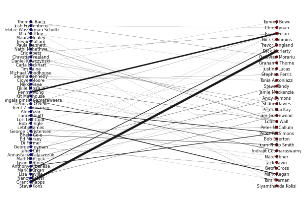

## Filtering over time

We thought that it could have been interesting to observe the evolution of our graph over time. We focus on a specific example : *2018 Football World Cup*. Our idea is that politicians might me speaking more about sport during big events like this. 

Then we investigate whether politicians are more connected with sportsmen in summer 2018 compared to summer 2017 and 2019. We build a bipartite graph between politicians and sportsmen for each year.

### Summer 2017


```python
# Plotting

B.remove_nodes_from(list(nx.isolates(B)))

top_nodes = {n for n, d in B.nodes(data=True) if d['sport'] == 0}

pos = nx.bipartite_layout(B, top_nodes)
widthes = [B.edges[e]['value'] / 10 for e in B.edges]
nx.draw(B, pos=pos, node_color = [B.nodes[n]['sport'] for n in B.nodes],node_size=10, cmap=plt.cm.jet, 
        width = widthes )
labels = nx.draw_networkx_labels(B, pos, labels=dict([(n,B.nodes[n]['name']) for n in B.nodes()]), font_size =6)
```


    

    


```python
# (Weighted) Number of edges

sum_w =0
for b in B.edges:
  sum_w += B.edges[b]['value']
print('Number of edges:', sum_w)
```

    Number of edges: 163
    


```python
degrees = dict(B.degree(B.nodes(),weight='value'))
sorted_degree = sorted(degrees.items(), key=itemgetter(1), reverse=True)

for speaker, degree in sorted_degree[:5]:
    print(B.nodes[speaker]['name'], 'is linked to', degree, 'people')
```

    Mark Roche is linked to 29 people
    Konrad Hurrell is linked to 24 people
    Annastacia Palaszczuk is linked to 24 people
    Graham Annesley is linked to 24 people
    Chris Reykdal is linked to 18 people
    

### Summer 2018


```python
# Plotting

B.remove_nodes_from(list(nx.isolates(B)))

top_nodes = {n for n, d in B.nodes(data=True) if d["sport"] == 0}

pos = nx.bipartite_layout(B, top_nodes)
widthes = [B.edges[e]['value'] / 10 for e in B.edges]
nx.draw(B, pos=pos, node_color = [B.nodes[n]['sport'] for n in B.nodes],node_size=10, cmap=plt.cm.jet, 
        width = widthes )
labels = nx.draw_networkx_labels(B, pos, labels=dict([(n,B.nodes[n]['name']) for n in B.nodes()]), font_size =6)
```


    

    


```python
# (Weighted) Number of edges

sum_w =0
for b in B.edges:
  sum_w += B.edges[b]['value']
print('Number of edges:', sum_w)
```

    Number of edges: 227
    


```python
degrees = dict(B.degree(B.nodes(),weight='value'))
sorted_degree = sorted(degrees.items(), key=itemgetter(1), reverse=True)

for speaker, degree in sorted_degree[:5]:
    print(B.nodes[speaker]['name'], 'is linked to', degree, 'people')
```

    Alex Hawke is linked to 51 people
    Peter FitzSimons is linked to 51 people
    Becky Wood is linked to 46 people
    Andrew Constance is linked to 46 people
    Shane Buckley is linked to 40 people
    

### Summer 2019


```python
# Plotting

B.remove_nodes_from(list(nx.isolates(B)))

top_nodes = {n for n, d in B.nodes(data=True) if d["sport"] == 0}

pos = nx.bipartite_layout(B, top_nodes)
widthes = [B.edges[e]['value'] / 10 for e in B.edges]
nx.draw(B, pos=pos, node_color = [B.nodes[n]['sport'] for n in B.nodes],node_size=10, cmap=plt.cm.jet, 
        width = widthes )
labels = nx.draw_networkx_labels(B, pos, labels=dict([(n,B.nodes[n]['name']) for n in B.nodes()]), font_size =6)
```


    

    


```python
# (Weighted) Number of edges

sum_w =0
for b in B.edges:
  sum_w += B.edges[b]['value']
print('Number of edges:', sum_w)
```

    Number of edges: 151
    


```python
degrees = dict(B.degree(B.nodes(),weight='value'))
sorted_degree = sorted(degrees.items(), key=itemgetter(1), reverse=True)

for speaker, degree in sorted_degree[:5]:
    print(B.nodes[speaker]['name'], 'is linked to', degree, 'people')
```

    Dick Moriarty is linked to 32 people
    Grant Shapps is linked to 32 people
    Israel Folau is linked to 26 people
    Penny Wong is linked to 20 people
    Peter FitzSimons is linked to 16 people
    

### Summary

If we look at the graph and the weighted number of edges, the connections of the graph are stronger during summer 2018.
The number of crossing edges is:
- 2017: 163
- 2018: 227
- 2019: 151

However when we observe the names, sportsmen quoted a lot are retired athletes, mostly ex-rugbymen. In the end we don't observe a lot of football names. 

Therefore we cannot really conclude on our statement "politicians talk more about sportsmen during World Cup". In fact, a politician might talk about a sportsmen in an article, but nothing implies that this sportsmen will be quoted in the same article. A graph based on mutual mention in quotes may have worked better (see annexe).


```python

```
