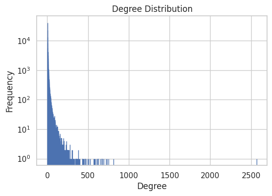
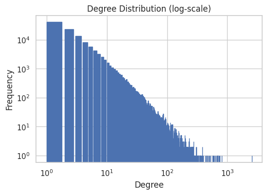

# Graph analysis

In this section, we observe different statistics of our big graph. This preliminary analysis helps us to understand the properties of the graph and therefore get to know how to explore it.

### General properties

Let's start by the number of nodes and edges:
- Nodes: 118824
- Edges: 374240

First thing to notice, the graph is very sparse:
- Sparsity = $\frac{|E|}{|E_{max}|}$ =  0.01%


As we want to do clustering, we take a look at the connected components.
- There are 4 connected components
- There are 3 small connected components (size 10, 13 and 13)
- There is on big connected componenents of 118788 speakers

It looks like we can not rely on connected components only.

### Degree

Who are the main speakers of our graph ? Are people very connected ? Let's figure this out !


```python
def plot_degree_distribution(G):
    degrees = {}
    for node in G.nodes():
        degree = G.degree(node)
        if degree not in degrees:
            degrees[degree] = 0
        degrees[degree] += 1
    sorted_degree = sorted(degrees.items())
    deg = [k for (k,v) in sorted_degree]
    cnt = [v for (k,v) in sorted_degree]
    fig, ax = plt.subplots()
    
    plt.bar(deg, cnt, color='b', log = True,ec = 'b', align='edge')
    plt.title("Degree Distribution")
    plt.ylabel("Frequency")
    plt.xlabel("Degree")
    plt.show()

    fig, ax = plt.subplots()
    plt.bar(deg, cnt, color='b', log = True,ec = 'b', align='edge')
    plt.title("Degree Distribution (log-scale)")
    plt.ylabel("Frequency")
    plt.xlabel("Degree")
    plt.xscale('log')
    plt.show()
```


```python
plot_degree_distribution(G)
```


    

    


    

    


Most of the speakers have very low degrees, but some have very high degree.
Indeed the degree distribution is following a **power-law**, which is typical for real world networks.

Who are those very famous people ?


```python
degrees = dict(G.degree(G.nodes()))
sorted_degree = sorted(degrees.items(), key=itemgetter(1), reverse=True)

for speaker, degree in sorted_degree[:10]:
    print(G.nodes[speaker]['name'], 'is linked to', degree, 'people')
```

    Donald Trump is linked to 2570 people
    Narendra Modi is linked to 812 people
    Emmanuel Macron is linked to 752 people
    Nancy Pelosi is linked to 733 people
    Mike Pompeo is linked to 718 people
    Boris Johnson is linked to 692 people
    Andrew Cuomo is linked to 690 people
    Benjamin Netanyahu is linked to 669 people
    António Guterres is linked to 646 people
    Justin Trudeau is linked to 620 people
    

The Top 10 central speakers in our graph are very famous country leaders.
We could have expected this, especially that Donald Trump is the most central.

### Clustering

Are there obvious and interpretable clusters ?

We use Louvain clustering method to check either we can identify interpretable cluster:
- the partition results of 543 clusters

It's a too large number for us to interpret each group by hand, we then focuse on attributes.

### Homophily
Which speaker attributes could be useful to filter on ? We compute the homophily with respect to *gender*, *nationality* and *political party*.

The homopholy estimate the similarity of connections in the graph with respect to the given attribute. 

Results of homopholy:
- gender: 0.225
- nationality: 0.404
- party: 0.321

Those results show that *nationality* is a good attribute to observe clusters. Indeed on the 3D graph we clearly distinguish clusters of speakers with the same nationality.
