# Homework 1 (HW1)

---
By the end of this homework we expect you to be able to:
1. Load data from different formats using [pandas](https://pandas.pydata.org/);
2. Navigate the documentation of Python packages by yourself;
3. Filter and tidy up noisy data sets;
4. Aggregate your data in different (and hopefully helpful) ways; 
5. Create meaningful visualizations to analyze the data;
6. Critically think and write about data;
---

## Important Dates

- Homework release: Fri 8 Oct 2021
- **Homework due**: Fri 22 Oct 2021, 23:59
- Grade release: Fri 29 Oct 2021

---

##  Some rules

1. You are allowed to use any built-in Python library that comes with Anaconda. If you want to use an external library, 
you may do so, but must justify your choice.
2. Make sure you use the `data` folder provided in the repository in read-only mode. (Or alternatively, be sure you 
don’t change any of the files.)
3. Be sure to provide a textual description of your thought process, the assumptions you made, the solution you 
implemented, and explanations for your answers. A notebook that only has code cells will not suffice.
4. For questions containing the **/Discuss:/** prefix, answer not with code, but with a textual explanation
 (**in markdown**).
5. Back up any hypotheses and claims with data, since this is an important aspect of the course.
6. Please write all your comments in English, and use meaningful variable names in your code. Your repo should have a 
single notebook (plus the required data files) in the *master/main* branch. If there are multiple notebooks present, 
we will **not grade** anything.
7. We will **not run your notebook for you**! Rather, we will grade it as is, which means that only the results 
contained in your evaluated code cells will be considered, and we will not see the results in unevaluated code cells. 
Thus, be sure to hand in a **fully-run and evaluated notebook**. In order to check whether everything looks as intended,
 you can check the rendered notebook on the GitHub website once you have pushed your solution there.
8. In continuation to the previous point, interactive plots, such as those generated using `plotly`, should be 
**strictly avoided**!
9. Make sure to print results or dataframes that confirm you have properly addressed the task.

---

## Context

In this project, we are going to analyze data from an experiment about *honesty*. 
Oftentimes, we are asked to confirm our honest intentions by signing **at the end** of a document. 
For example, in tax returns or insurance policy forms, we are often asked to sign our names under a text that reads 
something like "I hereby certify that the above statements are true and correct to the best of my knowledge."

However, when individuals sign **after** lying in the form, they may not feel the need to correct the falsehoods they 
have reported. In that context, it could be that signing at **the beginning** rather than at the end of the document 
would decrease dishonesty, as those who are filling the form would be aware of the ethical requirements *before* they 
provide the information in the form.

This intuition has led researchers to partner up with a motorcycle insurance company to run a randomized experiment. 
In this insurance company (as well as in many others), customers had to report the exact *odometer kilometrage*¹ in 
order for the company to adjust the insurance premiums. Note that motorcycles with lower kilometrage are less likely to 
have issues, and thus will result in a lower *insurance premium*². Therefore, customers have an incentive to lie, 
reporting a kilometrage lower than the real value, in order to save money.

In the experiment, two different forms were created: one where the signing was done at the end, and another where the 
signing was done at the beginning. The insurance company then randomized these forms (i.e., each customer received
 exactly one form, each with probability 50%) and sent back the data that customers had provided. Some noteworthy 
 details on the experiment are that:

- All customers involved in the experiment already had a contract with the company and were simply renewing it. 
In the data that the company provided, they also report the odometer kilometrage for their previous contract.
Each policy, therefore, contains two contracts: the "updated" contract —where the experiment was conducted— and 
the "baseline" contract, which was the previous contract customers had with the company.
- A single insurance policy can insure up to 4 distinct motorcycles.

In this assignment, you will take the role of the researcher and work analyzing this data!

*Glossary:*
1. **odometer kilometrage:** the total distance the motorcycle has traveled.
2. **insurance premiums:** the amount of money one pays for an insurance policy.

---

## The data

The company provided you with a compressed `.tsv` file containing one row per policy. 
The `.tsv` has the following fields:

- `condition`: either `Sign Top` or `Sign Bottom`, depending on which form was sent.
- `id`: unique identifier for each insurance policy.
- `motorcycle_count`: number of motorcycles covered by the insurance policy.
- `baseline_motorcycle[1-4]`: odometer kilometrage *reported by the customer* in the *previous (baseline)* contract. 
- `update_motorcycle[1-4]`: odometer kilometrage *reported by the customer* in the *current (updated)* contract.

Some comments:

- Recall that a single policy can ensure up to 4 motorcycles, and thus, the suffixes [1-4] indicate that there are 4 
versions of these columns in the data (e.g., `baseline_motorcycle1`, `baseline_motorcycle2`, `baseline_motorcycle3`, 
`baseline_motorcycle4`). 
- When a policy has fewer than 4 motorcycles, only the columns with the smaller numerals are filled (e.g., if a policy 
insures one motorcycle,  only `baseline_motorcycle1` and `update_motorcycle1` will be filled).
- Note that we only have access to the odometer kilometrage reported by the customers, 
which may be different from the real kilometrage of the motorcycles.


```python
# Imports you may need
import seaborn as sns
from IPython.display import display, HTML
import matplotlib.pyplot as plt
import scipy.stats as stats
import pandas as pd
import numpy as np

import matplotlib as mpl
import matplotlib.ticker as tick
```


```python
# Visualization parameters

mpl.rcParams['figure.dpi']= 100
pd.set_option('display.max_rows', 3000)
sns.set(style="darkgrid")

COLOR1 = (0.2980392156862745, 0.4470588235294118, 0.6901960784313725, 0.5)
COLOR2 = (0.8666666666666667, 0.5176470588235295, 0.3215686274509804, 0.5)

def reformat_large_tick_values(tick_val, pos):
    """
    Turns large tick values (in the billions, millions and thousands) 
    such as 4500 into 4.5K and also appropriately turns 4000 into 4K 
    (no zero after the decimal).
    """
    if tick_val >= 1e9:
        val = round(tick_val/1000000000, 1)
        new_tick_format = '{:}B'.format(val)
    elif tick_val >= 1e6:
        val = round(tick_val/1000000, 1)
        new_tick_format = '{:}M'.format(val)
    elif tick_val >= 1e3:
        val = round(tick_val/1000, 1)
        new_tick_format = '{:}K'.format(val)
    elif tick_val < 1e3:
        new_tick_format = round(tick_val, 1)
    else:
        new_tick_format = tick_val

    # make new_tick_format into a string value
    new_tick_format = str(new_tick_format)
    
    # code below will keep 4.5M as is but change values such as 4.0M to 4M since that zero after the decimal isn't needed
    index_of_decimal = new_tick_format.find(".")
    
    if index_of_decimal != -1:
        value_after_decimal = new_tick_format[index_of_decimal+1]
        if value_after_decimal == "0":
            # remove the 0 after the decimal point since it's not needed
            new_tick_format = new_tick_format[0:index_of_decimal] + new_tick_format[index_of_decimal+2:]
            
    return new_tick_format

```

### **Task 1** — 4pts

Your first task is to load the dataset into memory using pandas. 
**You should load the data directly from the compressed files.**

Here, the files at hand are rather small, and you could easily uncompress the files to disk and work with them as plain 
text. Why, then, are we asking you to load the files compressed? The reason is that, in your life as a data scientist, 
this will often not be the case. Then, working with compressed files is key so that you don't receive email from your 
(often more responsible) colleagues demanding to know how you have managed to fill the entire cluster with your 
datasets. Another big advantage of compressing files is to simply read files faster. You will often find that reading
compressed data on the fly (uncompressing it as you go), is much faster than reading uncompressed data, since reading
and writing to disk may be your [bottleneck](https://skipperkongen.dk/2012/02/28/uncompressed-versus-compressed-read/). 

---

**Hint:** `pandas` can open compressed files.

**Hint:** In the real world (and in ADA-homework), your file often comes with some weird lines! 
This time you can safely ignore them (but in the real world you must try to understand why they are there!). 
Check the `error_bad_lines` or the `on_bad_lines` (depending on your pandas version) parameter on `read_csv`.


```python
DATA_FOLDER = 'data/'
DATASET = DATA_FOLDER+"data.tsv.gz"

# skip bad lines and warn which
df = pd.read_csv(DATASET, compression='gzip', sep='\t', on_bad_lines = 'warn')
df['condition'] = df.condition.astype('category')
df['motorcycle_count'] = df.motorcycle_count.astype('category')

df.head()
```

    b'Skipping line 2142: expected 11 fields, saw 27\n'


<div>
<style scoped>
    .dataframe tbody tr th:only-of-type {
        vertical-align: middle;
    }

    .dataframe tbody tr th {
        vertical-align: top;
    }

    .dataframe thead th {
        text-align: right;
    }
</style>
<table border="1" class="dataframe">
  <thead>
    <tr style="text-align: right;">
      <th></th>
      <th>condition</th>
      <th>id</th>
      <th>baseline_motorcycle1</th>
      <th>update_motorcycle1</th>
      <th>baseline_motorcycle2</th>
      <th>update_motorcycle2</th>
      <th>baseline_motorcycle3</th>
      <th>update_motorcycle3</th>
      <th>baseline_motorcycle4</th>
      <th>update_motorcycle4</th>
      <th>motorcycle_count</th>
    </tr>
  </thead>
  <tbody>
    <tr>
      <th>0</th>
      <td>Sign Top</td>
      <td>1</td>
      <td>896</td>
      <td>39198</td>
      <td>NaN</td>
      <td>NaN</td>
      <td>NaN</td>
      <td>NaN</td>
      <td>NaN</td>
      <td>NaN</td>
      <td>1</td>
    </tr>
    <tr>
      <th>1</th>
      <td>Sign Bottom</td>
      <td>2</td>
      <td>21396</td>
      <td>63511</td>
      <td>32659.0</td>
      <td>47605.0</td>
      <td>NaN</td>
      <td>NaN</td>
      <td>NaN</td>
      <td>NaN</td>
      <td>2</td>
    </tr>
    <tr>
      <th>2</th>
      <td>Sign Bottom</td>
      <td>3</td>
      <td>21340</td>
      <td>37460</td>
      <td>44998.0</td>
      <td>59002.0</td>
      <td>NaN</td>
      <td>NaN</td>
      <td>NaN</td>
      <td>NaN</td>
      <td>2</td>
    </tr>
    <tr>
      <th>3</th>
      <td>Sign Bottom</td>
      <td>4</td>
      <td>23912</td>
      <td>59136</td>
      <td>NaN</td>
      <td>NaN</td>
      <td>NaN</td>
      <td>NaN</td>
      <td>NaN</td>
      <td>NaN</td>
      <td>1</td>
    </tr>
    <tr>
      <th>4</th>
      <td>Sign Bottom</td>
      <td>5</td>
      <td>16862</td>
      <td>59292</td>
      <td>NaN</td>
      <td>NaN</td>
      <td>NaN</td>
      <td>NaN</td>
      <td>NaN</td>
      <td>NaN</td>
      <td>1</td>
    </tr>
  </tbody>
</table>
</div>


### Task 2 — 12pts

As a good data scientist, the first thing you do is to clean up the data and perform some small sanity checks.

**Hint:** Here we are considering as outliers numbers that are not plausible in the context of motorcycle kilometrages.

---

1. The motorcycle insurance company mentioned that each policy has a unique identifier, but that there may be duplicate 
rows (i.e., multiple rows with the same policy identifier). Check if there are duplicate policies and, if so, filter 
these rows from the data (always keeping the first).


```python
before = df.shape[0]
df = df.drop_duplicates(keep='first')
print('We removed {} duplicate rows'.format(before-df.shape[0]))
```

    We removed 8 duplicate rows


2. According to the company, all policies should have kept the number of motorcycles from the previous contract (i.e., 
the number of motorcycles recorded in baseline contracts should equal the number of motorcycles in updated contracts). 
Also, the number of odometer readings for each contract should be the same as the number stated in the 
`motorcycle_count` variable. Check the data to see if these two things hold. If not, filter the anomalous rows.

<font color = "DarkCyan">
First, let's check that the numbers of motorcycles don't change. 

With boolean logic over columns, we'll check that, for $1\le k \le 4$, if either `baseline_motorcycle{k}` or `update_motorcycle{k}` is $\texttt{NaN}$, then both are.
</font>


```python
to_delete = []
for k in range(1,5):
    bl = df[f'baseline_motorcycle{k}']
    ud = df[f'update_motorcycle{k}']
    #if at least one is NaN but not both 
    new_to_delete = df.index[(bl.isna() | ud.isna()) & ~ (bl.isna() & ud.isna())]
    to_delete.extend(new_to_delete.to_numpy())

print('There are {} rows that should be removed, based on a fact that\n'.format(len(to_delete))\
      +'each baseline_motorcycle{k} and update_motorcycle{k} are either both Nan or both not.')
```

    There are 0 rows that should be removed, based on a fact that
    each baseline_motorcycle{k} and update_motorcycle{k} are either both Nan or both not.


<font color = "DarkCyan">
So we can see that no row present this specific anomaly in this dataset.
    
Now let's check that `motorcycle_count` is the same as the actual number of motorcycles. Since we know that the number of motorcycles in update and baseline contracts is now consistent, we can simply use the baseline number.
We'll sum the number of baseline podometers that are not NaNs for each row, and compare it to `motorcycle_count`.
</font>


```python
actual_count = df[[f'baseline_motorcycle{k}' for k in range(1,5)]].notna().sum(axis=1)
to_drop = df.index[(actual_count != df.motorcycle_count)]
print(to_drop)
df.drop(to_drop, inplace=True)
```

    Int64Index([], dtype='int64')


3. Calculate the mean and the median value of each column related to kilometrages. Are the values obtained plausible? 
Visualize the distribution of the data and remove any extreme outliers.


```python
df.iloc[:,2:-1].describe().loc[['mean', '50%']]
```


<div>
<style scoped>
    .dataframe tbody tr th:only-of-type {
        vertical-align: middle;
    }

    .dataframe tbody tr th {
        vertical-align: top;
    }

    .dataframe thead th {
        text-align: right;
    }
</style>
<table border="1" class="dataframe">
  <thead>
    <tr style="text-align: right;">
      <th></th>
      <th>baseline_motorcycle1</th>
      <th>update_motorcycle1</th>
      <th>baseline_motorcycle2</th>
      <th>update_motorcycle2</th>
      <th>baseline_motorcycle3</th>
      <th>update_motorcycle3</th>
      <th>baseline_motorcycle4</th>
      <th>update_motorcycle4</th>
    </tr>
  </thead>
  <tbody>
    <tr>
      <th>mean</th>
      <td>7.413448e+14</td>
      <td>7.413448e+14</td>
      <td>67324.756948</td>
      <td>92277.813595</td>
      <td>67657.320282</td>
      <td>92849.408771</td>
      <td>67827.97546</td>
      <td>93374.279141</td>
    </tr>
    <tr>
      <th>50%</th>
      <td>5.633500e+04</td>
      <td>8.238800e+04</td>
      <td>56158.000000</td>
      <td>82066.000000</td>
      <td>58821.000000</td>
      <td>85645.000000</td>
      <td>68181.00000</td>
      <td>93387.500000</td>
    </tr>
  </tbody>
</table>
</div>


```python
fig, ax = plt.subplots(4,2,figsize= (11,7), sharex = 'row', sharey = 'row')

for i in range(8):
    sbplt = ax[i//2, i%2]
    sbplt.hist(df.iloc[:,i+2], bins = 100)
    sbplt.set_title(df.columns[i+2])
    
fig.tight_layout(pad=0.5)
fig.subplots_adjust(top=0.9)

fig.text(0.45,-0.01, "Number of km");
fig.text(0,0.4, "Number of policies", rotation = 90);
plt.suptitle('Distribution of km for each category');
```


    
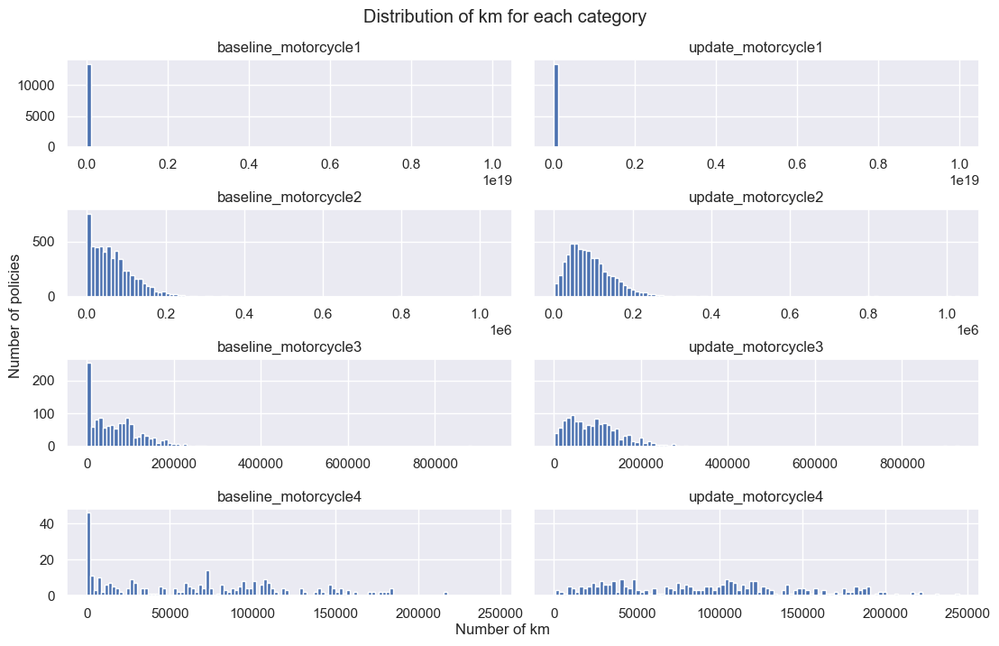
    


<font color = 'DarkCyan'>
We first choose to exclude all the data with any kilometrage higher than 10M, because it is way to high for a coherent lifetime of a motorcycle.
</font>


```python
#Removing all rows were there is a odometer reading greater than 1e7
#DataFrame.ge(threshold) a DataFrame of the same shape of True/False depending
# if the value is greater or not than the threshold in input.
#.any(axis=1) returns whether any element over each row is True
#.ge(threshold).any(axis=1) gives the rows that have a least one value greater than the threshold
# using ~ (NOT) allows us to keep all the raws without any values superior to the fixed threshold


df = df[~df.iloc[:,2:9].ge(1e7).any(axis = 1)]
```


```python
df.iloc[:,2:10].plot.box(figsize=(20,10)) 
plt.ylabel('Kilometrage')
plt.title('Distribution of km for the different categories');
```


    
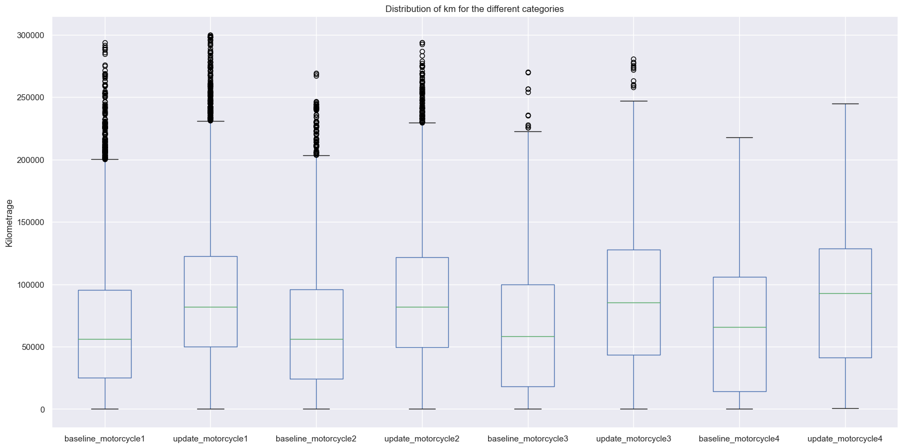
    


<font color='DarkCyan'>
We chose to keep odometer readings under 300.000km, as it is already a huge value of life time for a motorcycle.
</font> 


```python
limit = 300000
df = df[~df.iloc[:,2:9].ge(limit).any(axis = 1)]
```


```python
df.iloc[:,2:-1].describe().loc[['mean','50%']]
```


<div>
<style scoped>
    .dataframe tbody tr th:only-of-type {
        vertical-align: middle;
    }

    .dataframe tbody tr th {
        vertical-align: top;
    }

    .dataframe thead th {
        text-align: right;
    }
</style>
<table border="1" class="dataframe">
  <thead>
    <tr style="text-align: right;">
      <th></th>
      <th>baseline_motorcycle1</th>
      <th>update_motorcycle1</th>
      <th>baseline_motorcycle2</th>
      <th>update_motorcycle2</th>
      <th>baseline_motorcycle3</th>
      <th>update_motorcycle3</th>
      <th>baseline_motorcycle4</th>
      <th>update_motorcycle4</th>
    </tr>
  </thead>
  <tbody>
    <tr>
      <th>mean</th>
      <td>65642.428049</td>
      <td>90544.518333</td>
      <td>65832.600465</td>
      <td>90787.770647</td>
      <td>66029.199521</td>
      <td>91170.264964</td>
      <td>67006.26087</td>
      <td>92589.928571</td>
    </tr>
    <tr>
      <th>50%</th>
      <td>55943.000000</td>
      <td>81843.000000</td>
      <td>56001.500000</td>
      <td>81701.000000</td>
      <td>58117.000000</td>
      <td>85299.000000</td>
      <td>65550.00000</td>
      <td>92844.500000</td>
    </tr>
  </tbody>
</table>
</div>


```python
fig, ax = plt.subplots(4,2,figsize= (11,7), sharex = True, sharey = 'row')

for i in range(8):
    sbplt = ax[i//2, i%2]
    sbplt.hist(df.iloc[:,i+2], bins=range(0, limit + 10000, 5000))
    sbplt.set_title(df.columns[i+2])
    sbplt.xaxis.set_major_formatter(tick.FuncFormatter(reformat_large_tick_values));

fig.tight_layout(pad=0.5)
fig.subplots_adjust(top=0.9)

fig.text(0.45,-0.01, "Number of km");
fig.text(0,0.4, "Number of policies", rotation = 90);

plt.suptitle('Distribution of data for the different categories after filtering');
```


    
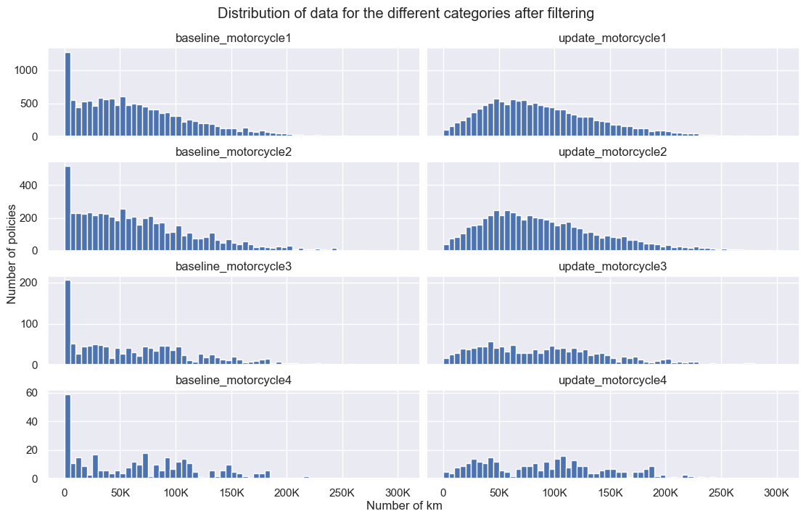
    


4. **Discuss:** In cases where you cannot think of appropriate ways to remove outliers, would you prefer summarizing 
numerical data with outliers with the mean or the median? Why?
---
<font color='DarkCyan'>
We would rather choose the median because the mean is strongly influenced by outliers if they are large values (regarding the original distribution). For the median, having few outliers just shift the rank of the value obtained, which doesn't change too much the order of magnitude.


In cases where you cannot think of appropriate ways to remove outliers, it would be better to summarize the numerical data with the median as it would be a better representative of the shape and occurrence of the data than the mean which will be skewed by the outliers.</font>


### Task 3 — 12pts

One of the challenges with the current data is that it is not clear how to handle policies with multiple motorcycles.

---

1. Create three additional columns in the dataframe, `baseline_average`, `update_average`, and `diff_average`. These 
should contain, respectively, the average value for `baseline_motorcycle[1-4]` for all motorcycles insured; the average
 value for `update_motorcycle[1-4]`; and the difference between the average updated value and the average baseline 
 value.


```python
#To select the columns on wich we apply the mean, we use condition on their name.
df['baseline_average'] = df[df.columns[pd.Series(df.columns).str.startswith('baseline')]].mean(axis=1)
df['update_average'] = df[df.columns[pd.Series(df.columns).str.startswith('update')]].mean(axis=1)
df['diff_average'] = df.update_average - df.baseline_average 
df.head()
```


<div>
<style scoped>
    .dataframe tbody tr th:only-of-type {
        vertical-align: middle;
    }

    .dataframe tbody tr th {
        vertical-align: top;
    }

    .dataframe thead th {
        text-align: right;
    }
</style>
<table border="1" class="dataframe">
  <thead>
    <tr style="text-align: right;">
      <th></th>
      <th>condition</th>
      <th>id</th>
      <th>baseline_motorcycle1</th>
      <th>update_motorcycle1</th>
      <th>baseline_motorcycle2</th>
      <th>update_motorcycle2</th>
      <th>baseline_motorcycle3</th>
      <th>update_motorcycle3</th>
      <th>baseline_motorcycle4</th>
      <th>update_motorcycle4</th>
      <th>motorcycle_count</th>
      <th>baseline_average</th>
      <th>update_average</th>
      <th>diff_average</th>
    </tr>
  </thead>
  <tbody>
    <tr>
      <th>0</th>
      <td>Sign Top</td>
      <td>1</td>
      <td>896</td>
      <td>39198</td>
      <td>NaN</td>
      <td>NaN</td>
      <td>NaN</td>
      <td>NaN</td>
      <td>NaN</td>
      <td>NaN</td>
      <td>1</td>
      <td>896.0</td>
      <td>39198.0</td>
      <td>38302.0</td>
    </tr>
    <tr>
      <th>1</th>
      <td>Sign Bottom</td>
      <td>2</td>
      <td>21396</td>
      <td>63511</td>
      <td>32659.0</td>
      <td>47605.0</td>
      <td>NaN</td>
      <td>NaN</td>
      <td>NaN</td>
      <td>NaN</td>
      <td>2</td>
      <td>27027.5</td>
      <td>55558.0</td>
      <td>28530.5</td>
    </tr>
    <tr>
      <th>2</th>
      <td>Sign Bottom</td>
      <td>3</td>
      <td>21340</td>
      <td>37460</td>
      <td>44998.0</td>
      <td>59002.0</td>
      <td>NaN</td>
      <td>NaN</td>
      <td>NaN</td>
      <td>NaN</td>
      <td>2</td>
      <td>33169.0</td>
      <td>48231.0</td>
      <td>15062.0</td>
    </tr>
    <tr>
      <th>3</th>
      <td>Sign Bottom</td>
      <td>4</td>
      <td>23912</td>
      <td>59136</td>
      <td>NaN</td>
      <td>NaN</td>
      <td>NaN</td>
      <td>NaN</td>
      <td>NaN</td>
      <td>NaN</td>
      <td>1</td>
      <td>23912.0</td>
      <td>59136.0</td>
      <td>35224.0</td>
    </tr>
    <tr>
      <th>4</th>
      <td>Sign Bottom</td>
      <td>5</td>
      <td>16862</td>
      <td>59292</td>
      <td>NaN</td>
      <td>NaN</td>
      <td>NaN</td>
      <td>NaN</td>
      <td>NaN</td>
      <td>NaN</td>
      <td>1</td>
      <td>16862.0</td>
      <td>59292.0</td>
      <td>42430.0</td>
    </tr>
  </tbody>
</table>
</div>


2. **Discuss:** Propose another way of aggregating distinct motorcycles from a single policy. Point out a way in which 
this aggregation may be either better or worse than taking the average for the purpose of comparing the two scenarios in the study (sign at the top vs. sign at the bottom).
---
<font color='DarkCyan'> 

We could look only at the maximum of the kilometrages over the motorcycles, since we can suppose that people would be more dishonest for the motorcycles with more kilometrages. 
    
This way, one value is still representing one motorcycle, which is more intuitive.
However, we potentially lose a lot of information that would be stored in the other policies.
</font> 

3. To get a sense of the impact that policies with multiple motorcycles may have in the study, let's perform some 
additional analyses. Plot the distribution of motorcycles per policy in the data. Your plot should allow for the 
meaningful comparison of the values shown.


```python
sns.catplot(data = df, x = 'motorcycle_count',  kind="count")
plt.yscale('log')
plt.title('Distribution of motorcycles per policy in the data');
```


    
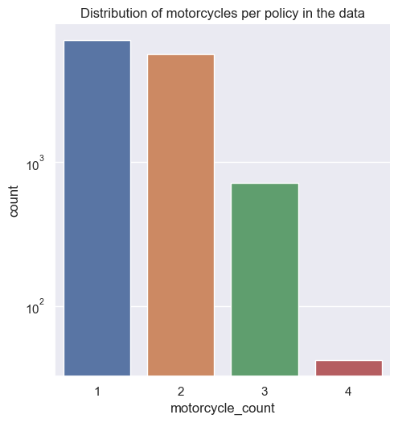
    


4. In 3.1, you calculated the average kilometrage for each policy for the updated contract. Calculate the mean and the 
standard deviation of these values (which should be in the column `update_average`).


```python
print('The mean over all policies of the updated average kilometer is:', 
      format(df.update_average.mean(), '1E'))
print('The standard deviation over all policies of the updated average kilometer is:',
      format(df.update_average.std(),'1E'))

df.update_average.hist(bins=50)
plt.xlabel('km');
plt.ylabel('Count');
ax1 = plt.gca()
ax1.xaxis.set_major_formatter(tick.FuncFormatter(reformat_large_tick_values));
plt.title('Distribution of the updated average');
```

    The mean over all policies of the updated average kilometer is: 9.059697E+04
    The standard deviation over all policies of the updated average kilometer is: 4.738067E+04


    
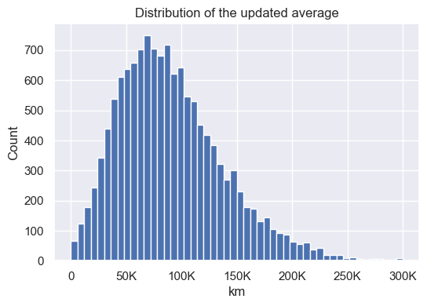
    


5. Another meaningful metric is the average kilometrage **per motorcycle**, not distinguishing motorcycles in different 
policies (i.e., pooled across policies). **Considering only policies with 4 motorcycles insured,** calculate the mean 
and the standard deviation of the kilometrage per motorcycle in the updated contract.


```python
df_four = df[df.motorcycle_count == 4]
df_four_flat = df_four[['update_motorcycle1','update_motorcycle2',
                        'update_motorcycle3','update_motorcycle4']].to_numpy().flatten()
mean = df_four_flat.mean()
std = df_four_flat.std()
print('For the policies with 4 motorcycles insured, \nthe mean is', format(mean,'1E'),
     '\nand the std worths ', format(std,'1E'))
```

    For the policies with 4 motorcycles insured, 
    the mean is 1.053662E+05 
    and the std worths  6.218559E+04


6. **Discuss:** To analyze whether signing at the top decreases dishonesty, we could consider the data in different 
ways. We could first calculate the average value per motorcycle within each policy and have one data point per policy or we could analyze the data at the motorcycle level and have one data point per motorcycle in the dataset. 
According to questions 3.4 and 3.5, how may this decision influence the results of the study?

---


<font color='DarkCyan'> 

The difference is quite small, but it seems that the average per policy is lower than the average over all motorcycles. It seems to indicate that people that have several motorcycles also use them more, which is not surprising. Choosing the average over motorcycles would comparatively give more weight to the policies of clients that have more  motorcycles.
   

</font> 

### Task 4 — 18pts

Now that we have compressed the kilometrage reported in each contract into a single number, it is time to analyze the 
million-dollar question: *does signing at the top decrease dishonesty?*

**Hint:** Recall that the column `condition` encodes the experimental condition in which the customer fell when 
reporting the values shown in columns `update_motorcycle[1-4]`!

**Hint:** To determine if the means of two sets of data are significantly different from each other, you may want to use
 the `ttest_ind` function implemented in the 
 [scipy library](https://docs.scipy.org/doc/scipy/reference/generated/scipy.stats.ttest_ind.html). To learn more about 
 Student's t-test, check out this [Wikipedia page](https://en.wikipedia.org/wiki/Student%27s_t-test).

---

1. Considering the updated contracts, calculate the mean and the standard deviation of the average kilometrage in a) 
policies where the signing was done at the bottom; and b) policies where the signing was done at the top. Additionally,
plot the two kilometrage distributions.


```python
df_top = df[df.condition == 'Sign Top']
df_bot = df[df.condition == 'Sign Bottom']

print('Mean over top signed:', format(df_top.update_average.mean(), '1E'))
print('Standard deviation over top signed:', format(df_top.update_average.std(),'1E'))

print('Mean over bottom signed:', format(df_bot.update_average.mean(), '1E'))
print('Standard deviation over bottom signed:', format(df_bot.update_average.std(),'1E'))

sns.histplot(data = df, x = 'update_average', hue = 'condition')

ax1 = plt.gca()
ax1.xaxis.set_major_formatter(tick.FuncFormatter(reformat_large_tick_values));
ax1.set_xlabel('km')
plt.title('Distribution of the update_average per condition');
```

    Mean over top signed: 8.435530E+04
    Standard deviation over top signed: 4.660309E+04
    Mean over bottom signed: 9.700012E+04
    Standard deviation over bottom signed: 4.732080E+04


    
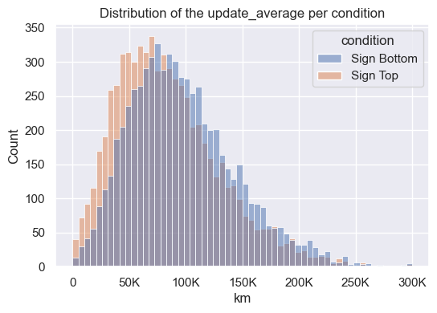
    


2. Determine whether the difference between the two scenarios mentioned in 1. is statistically significant.


```python
ttest = stats.ttest_ind(df_top.update_average, df_bot.update_average)
ttest
```


    Ttest_indResult(statistic=-15.578921723838214, pvalue=3.028677864406034e-54)


<font color = 'DarkCyan'>
    
As p-value is smaller than 0.05, we reject the null hypothesis at level 95% which means there is a significant difference between the averages in the two groups.
</font>

3. **Discuss:** Recall that the assignment of the different contracts (*sign at the top* vs. *sign at the bottom*) was 
done at random. According to the results in 1. and 2., does signing at the top decrease dishonesty? 

---

<font color = 'DarkCyan'>
    
It seems that there is a significant difference between policies with a honesty statement at the top or at the bottom of the document. However, the difference is not as we had expected : people that sign the honesty agreement at the top estimate lower values for their kilometrage.
 
    
</font>

4.  **Discuss:** Given that no intervention was performed in the baseline contract (i.e., everyone signed at the 
bottom). Would you expect any differences between the average values between *sign at the top* vs. *sign at the bottom*
 conditions for the baseline contract? Note that this is related to columns `baseline_motorcycle[1-4]`.

---

<font color = 'DarkCyan'>
   We should not expect any difference between for the average baseline values of the two conditions, since all clients signed at the bottom.
</font>

5. Calculate the mean and the standard deviation for the baseline contracts of the two groups (sign at the top vs. sign 
at the bottom). Additionally, plot the two kilometrage distributions.


```python
df_top = df[df.condition == 'Sign Top'].baseline_average
df_bot = df[df.condition == 'Sign Bottom'].baseline_average

print('Mean over top signed:', format(df_top.mean(), '1E'))
print('Standard deviation over top signed:', format(df_top.std(),'1E'))

print('Mean over bottom signed:', format(df_bot.mean(), '1E'))
print('Standard deviation over bottom signed:', format(df_bot.std(),'1E'))

sns.histplot(data = df, x = 'baseline_average', hue = 'condition')

ax1 = plt.gca()
ax1.xaxis.set_major_formatter(tick.FuncFormatter(reformat_large_tick_values));
ax1.set_xlabel('km')
plt.title('Distribution of the baseline_average per condition');
```

    Mean over top signed: 5.827359E+04
    Standard deviation over top signed: 4.470871E+04
    Mean over bottom signed: 7.334749E+04
    Standard deviation over bottom signed: 4.550194E+04


    
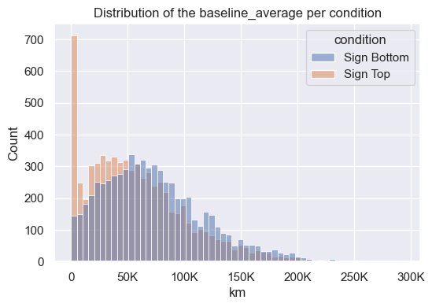
    


6. Determine whether the difference between the two scenarios mentioned in 5. is statistically significant.


```python
ttest = stats.ttest_ind(df_top, df_bot)
ttest
```


    Ttest_indResult(statistic=-19.336193357259532, pvalue=3.5033890004887764e-82)


<font color = 'DarkCyan'>
There is a non-negligible difference between the conditions for the baseline value, as is shown by the t-test and the shape of the distributions. Especially, there is a great difference in the number of near-zero kilometrages.
    
Taking into account the previous remarks, this outcome was unexpected.
</font>

## Interlude: Something is dodgy about this data...

---

Noticing the oddities in the data, you send an email to your contact at the insurance company asking about the integrity
 of the data. Their reply seems like something out of a detective movie:

> Dear researcher, I believe that this data is not to be trusted. I can't talk right now but will send further hints 
>throughout the week.

As a researcher, you know that [data integrity](https://en.wikipedia.org/wiki/Data_integrity) is a big deal, and decide
 to investigate.

### Task 5 — 9pts

The first hint you receive is: *there is something off about the kilometrage values in the data.*

---

1. For the baseline contract and for the updated contract, plot the distribution of odometer kilometrage reported for 
the first motorcycle insured in each policy. 


```python
sns.histplot(data = df, x= 'baseline_motorcycle1',color = COLOR1, label = 'baseline_motorcycle1')
sns.histplot(data = df, x= 'update_motorcycle1',color= COLOR2, label = 'update_motorcycle1')

ax1 = plt.gca()
ax1.xaxis.set_major_formatter(tick.FuncFormatter(reformat_large_tick_values));
plt.xlabel('km')
plt.legend()
plt.title('Distribution of odometer kilometrage reported for the first motorcycle insured in each policy');

```


    
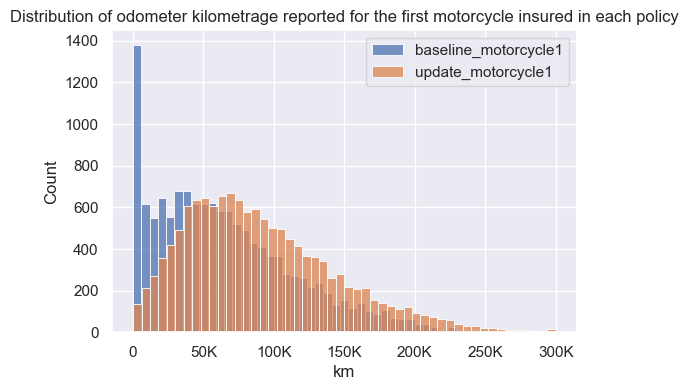
    


2. For the first motorcycle insured by the company in each policy, plot the difference between the number of kilometers
 reported in the baseline and in the updated contract.


```python
diff = df.update_motorcycle1 - df.baseline_motorcycle1
sns.histplot(data = diff,  bins = 50)
ax1 = plt.gca()
ax1.xaxis.set_major_formatter(tick.FuncFormatter(reformat_large_tick_values));
plt.xlabel('km')
plt.title('Difference between the number of kilometers reported in the baseline\n'\
          +'and in the updated contract for the first motorcycle insured ');

```


    
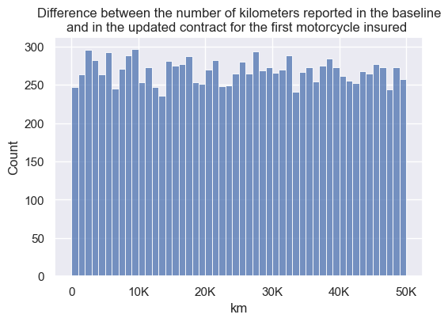
    


3. **Discuss:** why is this data unlikely to have originated from real odometer readings?

---

<font color = 'DarkCyan'>
The difference between baseline and updated for the first monocycle seems to follow a uniform distribution over [0,50000]. 
    

This is highly suspicious, as we'd expect the distribution of positive real-valued data such as the number of kilometers driven since the previous contract to be smoothly decreasing to 0 at infinity, rather than being constant then suddenly cut off. Besides, not a lot of people should not have used their motorcycle, so the curve should be increasing at the beginning.
    
Thus, the reason this data could not have come from an odometer reading is because the data should follow a "bell curve" (but not necessarily a Gaussian distribution).
</font>

### Task 6 — 15pts

The second hint you receive is: *there is something off with the last digits of the reported kilometrages.*

**Hint:** The last two digits of the number 12314 are 314. Note that you should consider the three last digits together,
 not separately!

---

1. Considering the baseline kilometrage of the first motorcycle in each contract (`baseline_motorcycle1`), plot the 
distribution of occurrences of the last three digits. Repeat the same for the updated kilometrage of the first 
motorcycle in each contract (`update_motorcycle1`).


```python
fig, ax = plt.subplots(2,1, figsize=(10,5), sharey = True)

sns.histplot(data = df.baseline_motorcycle1 % 1000, ax=ax[0],
             label='baseline_motorcycle1', bins = 1000)
sns.histplot(data = df.update_motorcycle1 % 1000, ax=ax[1],
             color= COLOR2, label='update_motorcycle1', bins = 1000)


ax[0].set_title('Baseline', y=0.85)
ax[0].set_yscale('log')

ax[1].set_title('Update', y=0.85)
ax[1].set_yscale('log')

ax[0].set_xticks([100*k for k in range(11)])
ax[1].set_xticks([100*k for k in range(11)])

ax[0].set_xlabel('')
ax[1].set_xlabel('Last 3 digits')

fig.tight_layout(pad=1.5)
fig.subplots_adjust(top=0.9)


fig.suptitle('Last three digits occurence for kilometrage');
plt.show()
```


    
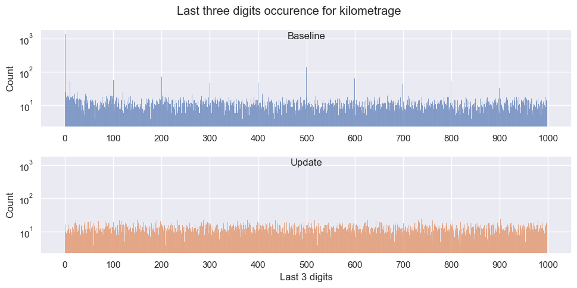
    


2. **Discuss:** What are the differences between the two distributions?

---

<font color = 'DarkCyan'>    
We can see that the distribution of the 3 last digits seem uniform in the updated value. However, the distribution of the baseline is really inflated for all multiples or 100, and especially 0.    
    

</font>


3. **Discuss:** Hypothesize a **plausible** cause for the patterns observed in the digit distribution of the baseline kilometrage of the first motorcycle.
 
---

<font color = 'DarkCyan'>
   
A first hypothesis would be that, since the baseline has many more values with 000 as the last digits, the baseline actually has a lot of zeros, that would correspond to new motorcycles, with a kilometrage of 0 at the moment of the first contract.  
    

</font>


```python
(df.baseline_motorcycle1 == 0 ).sum() 
```


    117


```python
(df.baseline_motorcycle1%1000 == 0 ).sum() # shows that's not only new contracts (117 / 1387)
```


    1387


<font color = 'DarkCyan'>
However, we can see that around 1400 values have their last 3 digits equal to 0. However only around 120 values are near to 0. This first hypothesis is therefore wrong.

Another, more likely hypothesis would be that people tend to round up the kilometrages to the nearest hundred or thousand when writing them for their contract. Indeed, we can see that there are peaks at each hundred, and especially at 000 and 500. 
    
In that case, the values of the update seem suspicious as we see no such pattern. Thus, we could infer that the update value have been randomly and uniformly generated, which would be consistent with the observation that the difference between update and baseline is uniformly generated.
    
</font>

### Task 7 — 15pts

The third (and last) hint you receive is: *there is something wrong with the fonts.*

Your anonymous source explains that the `.tsv` file sent to you was derived from an Excel sheet. There, some of the rows
 were written in the font *Helvetica* while others were written in the font *Arial*. Your anonymous source sends you a 
 file with the relation between policy id and the font used in the respective row (`fonts.csv`), and tells you that the
  rows with *Helvetica* font were fabricated.


1. Load `fonts.csv` and merge the `font` column into your pandas dataframe.


```python
DATASET2 = DATA_FOLDER+"fonts.csv"
font = pd.read_csv(DATASET2, index_col = 'id', dtype = {'font' : 'category'})
data_f = df.merge(font, on = 'id')
data_f.head()
```


<div>
<style scoped>
    .dataframe tbody tr th:only-of-type {
        vertical-align: middle;
    }

    .dataframe tbody tr th {
        vertical-align: top;
    }

    .dataframe thead th {
        text-align: right;
    }
</style>
<table border="1" class="dataframe">
  <thead>
    <tr style="text-align: right;">
      <th></th>
      <th>condition</th>
      <th>id</th>
      <th>baseline_motorcycle1</th>
      <th>update_motorcycle1</th>
      <th>baseline_motorcycle2</th>
      <th>update_motorcycle2</th>
      <th>baseline_motorcycle3</th>
      <th>update_motorcycle3</th>
      <th>baseline_motorcycle4</th>
      <th>update_motorcycle4</th>
      <th>motorcycle_count</th>
      <th>baseline_average</th>
      <th>update_average</th>
      <th>diff_average</th>
      <th>font</th>
    </tr>
  </thead>
  <tbody>
    <tr>
      <th>0</th>
      <td>Sign Top</td>
      <td>1</td>
      <td>896</td>
      <td>39198</td>
      <td>NaN</td>
      <td>NaN</td>
      <td>NaN</td>
      <td>NaN</td>
      <td>NaN</td>
      <td>NaN</td>
      <td>1</td>
      <td>896.0</td>
      <td>39198.0</td>
      <td>38302.0</td>
      <td>Helvetica</td>
    </tr>
    <tr>
      <th>1</th>
      <td>Sign Bottom</td>
      <td>2</td>
      <td>21396</td>
      <td>63511</td>
      <td>32659.0</td>
      <td>47605.0</td>
      <td>NaN</td>
      <td>NaN</td>
      <td>NaN</td>
      <td>NaN</td>
      <td>2</td>
      <td>27027.5</td>
      <td>55558.0</td>
      <td>28530.5</td>
      <td>Helvetica</td>
    </tr>
    <tr>
      <th>2</th>
      <td>Sign Bottom</td>
      <td>3</td>
      <td>21340</td>
      <td>37460</td>
      <td>44998.0</td>
      <td>59002.0</td>
      <td>NaN</td>
      <td>NaN</td>
      <td>NaN</td>
      <td>NaN</td>
      <td>2</td>
      <td>33169.0</td>
      <td>48231.0</td>
      <td>15062.0</td>
      <td>Helvetica</td>
    </tr>
    <tr>
      <th>3</th>
      <td>Sign Bottom</td>
      <td>4</td>
      <td>23912</td>
      <td>59136</td>
      <td>NaN</td>
      <td>NaN</td>
      <td>NaN</td>
      <td>NaN</td>
      <td>NaN</td>
      <td>NaN</td>
      <td>1</td>
      <td>23912.0</td>
      <td>59136.0</td>
      <td>35224.0</td>
      <td>Helvetica</td>
    </tr>
    <tr>
      <th>4</th>
      <td>Sign Bottom</td>
      <td>5</td>
      <td>16862</td>
      <td>59292</td>
      <td>NaN</td>
      <td>NaN</td>
      <td>NaN</td>
      <td>NaN</td>
      <td>NaN</td>
      <td>NaN</td>
      <td>1</td>
      <td>16862.0</td>
      <td>59292.0</td>
      <td>42430.0</td>
      <td>Arial</td>
    </tr>
  </tbody>
</table>
</div>


2. Considering only the kilometrage of the first motorcycle in each policy, calculate the number of rows with the Arial 
and the Helvetica font, respectively. Also, plot the distribution of baseline kilometers for rows with the Arial font 
and for rows with the Helvetica font.


```python
gb = data_f.groupby('font')
gb.count()['id']
```


    font
    Arial        6695
    Helvetica    6696
    Name: id, dtype: int64


```python
sns.displot(data=data_f, x='baseline_motorcycle1', hue='font')

ax1 = plt.gca()
ax1.xaxis.set_major_formatter(tick.FuncFormatter(reformat_large_tick_values));
plt.xlabel('km');
plt.title('Distribution of baseline kilometers for the 2 fonts');
```


    
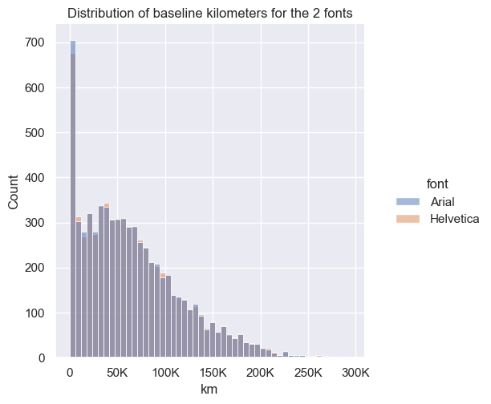
    


3. Similar to what was done in task 6. Plot the distribution of the last three digits for 1) the first motorcycle in 
each baseline contract (`baseline_motorcycle1`); and 2) the first motorcycle in each updated contract
 (`update_motorcycle1`).


```python
occ_baseline = data_f.baseline_motorcycle1 % 1000
occ_update = data_f.update_motorcycle1 % 1000

fig, ax = plt.subplots(2,1, figsize=(10,5), sharey = True)

df_2 = pd.concat((occ_baseline, data_f.font), axis=1)
sns.histplot(data=df_2,x='baseline_motorcycle1', hue="font", ax=ax[0], bins=1000)

df_2 = pd.concat((occ_update, data_f.font), axis=1)
sns.histplot(data=df_2,x='update_motorcycle1', hue="font", ax=ax[1],  bins=1000)

ax[0].set_title('Baseline', y=0.85)
ax[0].set_yscale('log')

ax[1].set_title('Update', y=0.85)
ax[1].set_yscale('log')

ax[0].set_xticks([100*k for k in range(11)])
ax[1].set_xticks([100*k for k in range(11)])

ax[0].set_xlabel('')
ax[1].set_xlabel('Last 3 digits')

fig.tight_layout(pad=1.5)
fig.subplots_adjust(top=0.9)


fig.suptitle('Last three digits occurence for kilometrage');
plt.show()
```


    

    


4. **Discuss:** Why do these analyses provide evidence that the rows with Helvetica font were fabricated?

---

<font color = 'DarkCyan'>
We can see that for the baseline, only the rows on Arial font have peaks at the multiples of 100, which is evidence that the Helvetica rows have been fabricated.
    
Indeed, those peaks are a sign that real people, who tend to round to the hundred, have filled the form.
</font>

### Task 8 — 15pts

You've had enough! You decide to write an email to your PI (principal investigator, also known as "your boss") reporting
 the oddities you have observed in the data. Write a (brief) text (in markdown) of up to 300 words. Your text should:

- Use the analyses you did to make a convincing case that the data has been tampered with. 
- Grounded in your analyses, provide a plausible hypothesis about how the data has been tampered with.
- Discuss whether the data leads to the conclusion that signing at the top decreases dishonesty.

Structure your text into three bullets, analogous to the ones above.

You can reference images present in the notebook by indicating a task (e.g., image plotted in Task 3.3) or a cell 
number.

Note that you do not need to conduct any additional analysis to write this text. If you do, the code should be at the 
end of this notebook, i.e., after your answer.

---

**Hint:** The data has been tampered with in more than one way.

#### Dear Boss,
 - As we can see in Task 2.2, the distribution of the difference between baseline and updated kilometrage seem uniform, which is quite unexpected for real data.  
 - Furthermore, we can see in plots of tasks 6.1 and 7.3 that the values for the baseline kilometrages in the Arial rows are more likely to be multiple of 100, and especially of 500 or 1000. However, this is not the case for the Helvetica rows and the updated kilometrages. This discrepancy is a sign of tampering.
 - Finally, the distributions of the baseline values are different for the "Top signed" and the "Bottom signed" conditions, even though there was no experimental difference. We shouldn’t observe such a difference, therefore we can suspect tampering. 

- Ways of tampering :
 - A first plausible way that the data has been tampered is the creation of the updated kilometrage by adding a uniformly distributed random variable to the baseline value. This would explain the distribution of the differences.
 - Secondly, the peaks at multiples of 100 in the Arial kilometrage distribution is to be expected. This is simply the result of people spontaneously rounding to the nearest hundred or thousand when filling in the forms. This implies that the values in the Helvetica rows were randomly generated out of the Arial distribution.
 - Finally, the difference in the distributions of the baseline values for the two conditions suggests that zeroes have been added in the "Sign Top" condition, maybe in order to decrease the average.
 
- To conclude, although we found that the average updated value is statistically significantly higher when people sign at the top, we really can't conclude anything given the amount of tampering in this data. We would recommend not working with this company again in the future.


