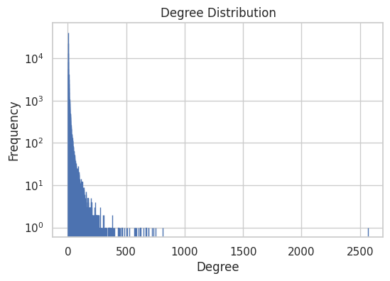
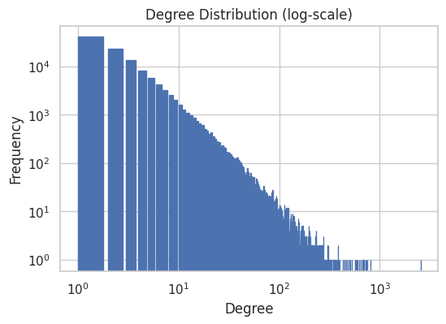

## Introduction

We present our project on modeling a speaker network using Quotebank. The dataset is a corpus of 178 million quotations attributed to the speakers who uttered them, extracted from 162 million English news articles published between 2008 and 2020. We use a speaker attribute table from Wikidata to extract information on the individuals.
This project aims to explore the relationships between people quoted in the Quotebank dataset. Specifically, we construct a graph based on co-quotation of speakers in the same articles, using years from 2015 to 2020. Visualizing these relationships can give us an understanding of the networks and communities that are behind quotes, such as professional domains and fields of expertise, political orientation, and even like-mindedness.
Secondly we focus on specific case studies using our graph properties to understand links between speakers in those scenarios.

## 2020 Interactive Quote Graph

 

    
    
    
    
    
    <!---->
    

    
    

  

<a href="3d-JS-Network/graph_title_final.html">Click Here for Full Screen And Interactive Data Viz</a>

## Graph Analysis

In this section, we observe different statistics of our big graph. This preliminary analysis helps us to understand the properties of the graph and therefore get to know how to explore it.

### General properties

Let's start by the number of nodes and edges:
- Nodes: 118824
- Edges: 374240

First thing to notice, the graph is very sparse:
Sparsity = $$ \frac{|E|}{|E_{max}|}$$ =  0.01% 

As we want to do clustering, we take a look at the connected components.
- There are 4 connected components
- There are 3 small connected components (size 10, 13 and 13)
- There is on big connected componenents of 118788 speakers

It looks like we can not rely on connected components only.

### Degree

Who are the main speakers of our graph ? Are people very connected ? Let's figure this out !

    

    
Most of the speakers have very low degrees, but some have very high degree.
Indeed the degree distribution is following a **power-law**, which is typical for real world networks.

Who are those very famous people ?

- Donald Trump is linked to 2570 people
- Narendra Modi is linked to 812 people
- Emmanuel Macron is linked to 752 people
- Nancy Pelosi is linked to 733 people
- Mike Pompeo is linked to 718 people
- Boris Johnson is linked to 692 people
- Andrew Cuomo is linked to 690 people
- Benjamin Netanyahu is linked to 669 people
- António Guterres is linked to 646 people
- Justin Trudeau is linked to 620 people
    

The Top 10 central speakers in our graph are very famous country leaders.
We could have expected this, especially that Donald Trump is the most central.

### Clustering

Are there obvious and interpretable clusters ?

We use Louvain clustering method to check either we can identify interpretable cluster:
- the partition results of 543 clusters

It's a too large number for us to interpret each group by hand, we then focuse on attributes.

### Homophily
Which speaker attributes could be useful to filter on ? We compute the homophily with respect to *gender*, *nationality* and *political party*.

The homophily estimate the similarity of connections in the graph with respect to the given attribute. 

Results of homophily:
- gender: 0.225
- nationality: 0.404
- party: 0.321

Those results show that *nationality* is a good attribute to observe clusters. Indeed on the 3D graph we clearly distinguish clusters of speakers with the same nationality.

<a class="btn btn-primary float-right" href="/Project_pages/index_2.html" data-toggle="tooltip" data-placement="top" title="" data-original-title="Exploring the Graph">Next Page →</a>

